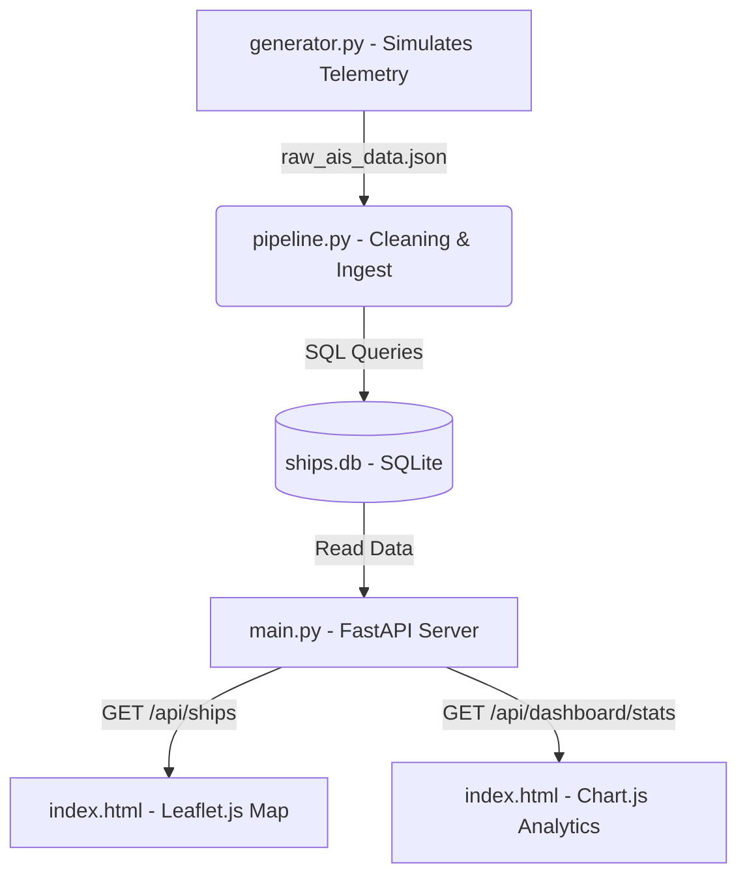

# Maritime Radar Tracking System (Strait of Hormuz & Arabian Sea)

An end-to-end maritime tracking data pipeline and real-time visualization dashboard designed to ingest, sanitize, store, and display AIS (Automatic Identification System) vessel telemetry in the Strait of Hormuz and Arabian Sea region.

---

## 1. Problem Statement & Project Overview

The Strait of Hormuz is one of the world's most strategically important maritime choke points. Monitoring vessel movement is critical for global trade safety, shipping operations, and defense security. However, raw AIS data streams from satellite and ground receivers are notoriously noisy. They often contain:
- Exact transmission duplicates.
- Multi-receiver signal collisions (ships sending reports at the exact same timestamp with conflicting metrics).
- Out-of-bounds geographic outliers (signals bouncing or GPS malfunctions placing ships inland or in incorrect hemispheres).
- Non-uniform timestamp formats (Unix epoch, ISO-8601, and custom localized regional strings mixed together).
- Cryptic raw integer ship type codes.

This project implements a complete **telemetry ingestion and cleaning pipeline** that resolves these issues. The pipeline extracts, sanitizes, and stores records in a relational database, then exposes the data via a **FastAPI backend** to a **responsive Leaflet.js and Chart.js frontend dashboard**.

---

## 2. Data Sources & Specifications

### Geographic Bounding Box
Telemetry data is filtered and validated to fit within the designated operations theater:
- **Latitude**: `12.0°N` to `28.0°N` (encompassing the southern Arabian Sea up to the northern Persian Gulf).
- **Longitude**: `50.0°E` to `65.0°E` (covering the eastern coast of Saudi Arabia/UAE, Oman, and parts of Iran/Pakistan).

### Vessel Categorization
Vessels are classified based on the standard **ITU Maritime Mobile Service (MMS) Ship Type Code** specifications:
- **Fishing Vessels**: Type code `30`
- **Cargo Vessels**: Type codes `70` to `79`
- **Oil Tankers**: Type codes `80` to `89`
- **Other**: Passenger ships, sailing vessels, tugboats, and unknown craft (e.g. types `36`, `52`, `60`, etc.)

### Telemetry Simulation
The `src/generator.py` script mimics live ship traffic routes, generating realistic coordinates in the gulf region while intentionally injecting data anomalies (missing/invalid fields, duplicates, and multiple timestamp formats) to test the pipeline's sanitization logic.

---

## 3. Project Architecture

The system utilizes a decoupled three-tier architecture:



### Directory Structure
- `src/`
  - [generator.py](file:///c:/Users/didor/Downloads/college/global-ship-radar/src/generator.py): Mock generator producing simulated raw vessel data.
  - [pipeline.py](file:///c:/Users/didor/Downloads/college/global-ship-radar/src/pipeline.py): The Pandas cleaning pipeline (deduplication, date parsing, geographic bounding box filter, and category mapping).
  - [main.py](file:///c:/Users/didor/Downloads/college/global-ship-radar/src/main.py): FastAPI web server querying `ships.db` and serving json endpoints with CORS support.
  - [verify.py](file:///c:/Users/didor/Downloads/college/global-ship-radar/src/verify.py): Standalone script executing database constraints sanity assertions.
  - [test_api.py](file:///c:/Users/didor/Downloads/college/global-ship-radar/src/test_api.py): Backend endpoint integration test suite.
- [index.html](file:///c:/Users/didor/Downloads/college/global-ship-radar/index.html): Responsive dashboard integrating Tailwind CSS, Leaflet.js Map, Leaflet.heat overlay, and Chart.js analytics.

---

## 4. Setup & Ingestion Pipeline Instructions

### Prerequisites
Ensure Python (version 3.12 or higher) is installed on your computer.

### Step 1: Install Dependencies
Open your terminal inside the project directory and run:
```powershell
pip install pandas fastapi uvicorn httpx
```

### Step 2: Generate Raw Simulated Data
Generate mock vessel data containing telemetry anomalies:
```powershell
python src/generator.py
```
This generates a file named `raw_ais_data.json` in the root of your directory.

### Step 3: Run Ingestion & Sanitization Pipeline
Load raw telemetry, clean it, and load it into the database:
```powershell
python src/pipeline.py
```
This processes the JSON and creates a structured relational database named `ships.db`.

### Step 4: Run Data Integrity Checks
Verify that coordinates, timestamp formats, and category maps are correct:
```powershell
python src/verify.py
```

---

## 5. Running the Backend & Dashboard

### Step 1: Start the API Server
Launch the FastAPI development server:
```powershell
py -3.12 -m uvicorn src.main:app --port 8000 --reload
```
You can view the interactive Swagger documentation by navigating to [http://localhost:8000/docs](http://localhost:8000/docs).

### Step 2: Access the Frontend Dashboard
Simply double-click or open the [index.html](file:///c:/Users/didor/Downloads/college/global-ship-radar/index.html) file in any web browser.

#### Features inside the dashboard:
1. **Map Console**: Move around the map, toggle the **"Density Heatmap"** button to identify high-density transit routes, search for vessels, or toggle checkboxes to filter out ship categories.
2. **Interactive List**: Click on any ship in the sidebar to fly/pan to the ship, zoom in, and inspect its telemetry popup details.
3. **Analytics Dashboard**: Switch tabs to inspect dynamically rendering Doughnut, Bar, and Line charts showing distribution, total counts, and temporal traffic densities.
